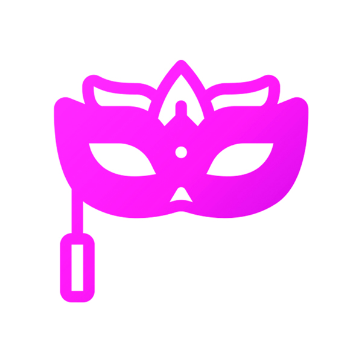
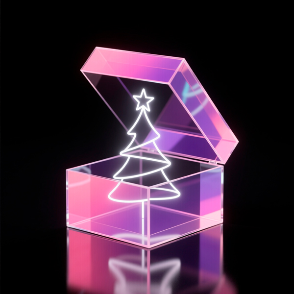
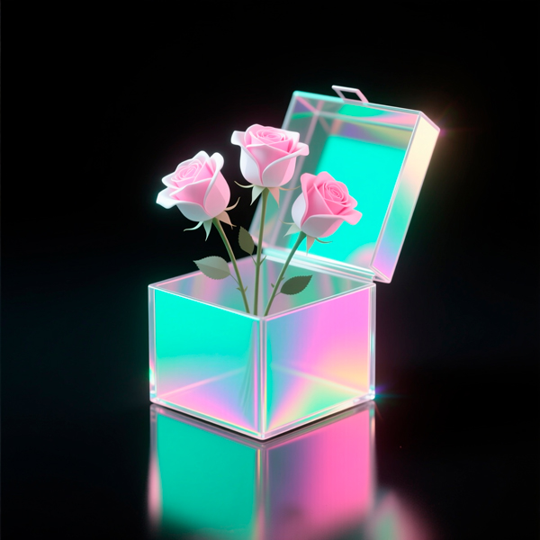
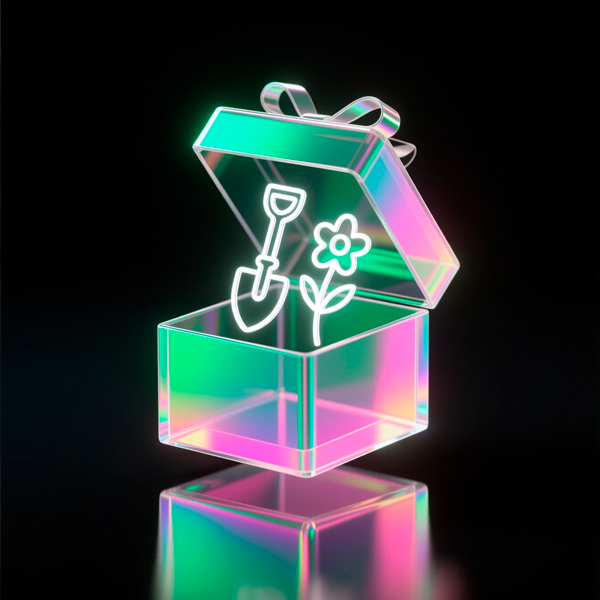
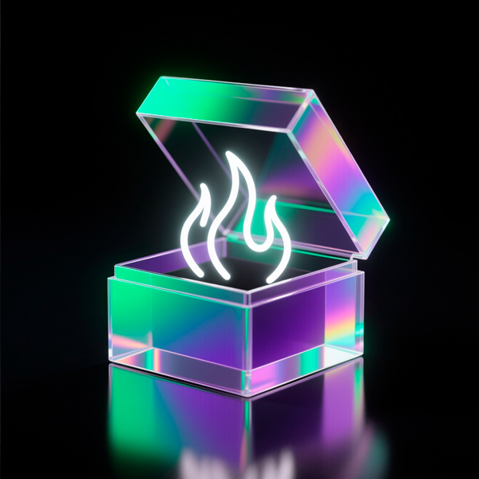
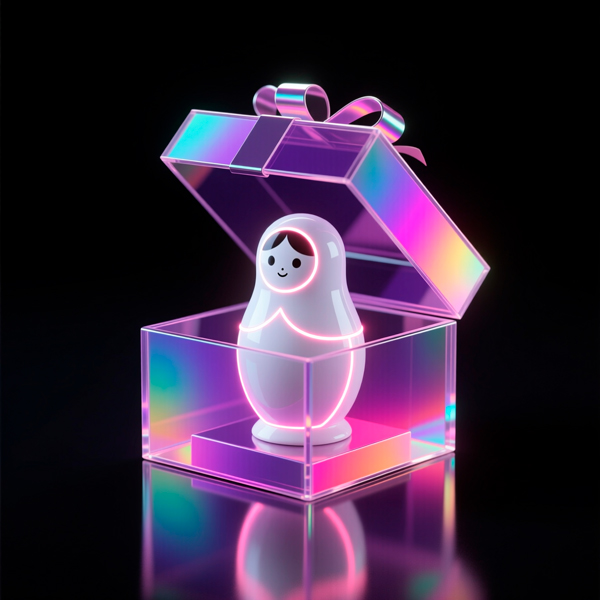
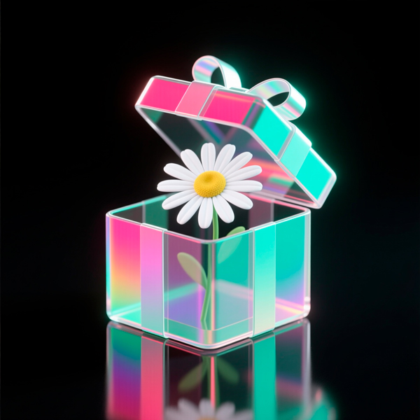
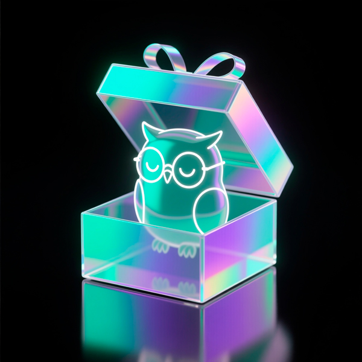
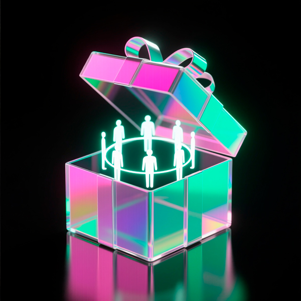

# Festival Collection
### Роботы для праздничных сюрпризов  
Особые дни · Личное внимание · Праздничные впечатления  

Подборка ботов для живых сообществ: поздравления, внимание, эмоции, праздник и вдохновение.  
Последнее обновление: 29.01.2026

---

<table style="width: 100%; border-collapse: collapse;">
  <tr>
    <td style="vertical-align: top; width: 0; padding: 0;">
      
    </td>
    <td style="vertical-align: top; padding-left: 15px;">
      <h3 style="margin-top: 0;">Festival</h3>
      
$0

    </td>
  </tr>
</table>
With purchases over $200, you receive all the gifts

---

<table style="width: 100%; border-collapse: collapse; margin-bottom: 20px;">
  <tr>
    <td style="vertical-align: top; width: 0; padding: 0;">
      
    </td>
    <td style="vertical-align: top; padding-left: 15px;">
      <h3 style="margin-top: 0;">Новый год</h3>
      
$10

    </td>
  </tr>
</table>
Сюрприз-пробуждение: ощущение нового начала и свежего старта в вашей жизни

---

<table style="width: 100%; border-collapse: collapse; margin-bottom: 20px;">
  <tr>
    <td style="vertical-align: top; width: 0; padding: 0;">
      
    </td>
    <td style="vertical-align: top; padding-left: 15px;">
      <h3 style="margin-top: 0;">День защитника Отечества</h3>
      
$10

    </td>
  </tr>
</table>
Сюрприз-бдительность: напоминание о заботе, ответственности и внутренней силе

---

<table style="width: 100%; border-collapse: collapse; margin-bottom: 20px;">
  <tr>
    <td style="vertical-align: top; width: 0; padding: 0;">
      
    </td>
    <td style="vertical-align: top; padding-left: 15px;">
      <h3 style="margin-top: 0;">Женский день</h3>
      
$10

    </td>
  </tr>
</table>
Сюрприз-нежность: напоминание о заботе, тепле и внутренней целостности

---

<table style="width: 100%; border-collapse: collapse; margin-bottom: 20px;">
  <tr>
    <td style="vertical-align: top; width: 0; padding: 0;">
      
    </td>
    <td style="vertical-align: top; padding-left: 15px;">
      <h3 style="margin-top: 0;">День весны и труда</h3>
      
$10

    </td>
  </tr>
</table>
Сюрприз-достоинство: уважение к труду и значимости собственного пути

---

<table style="width: 100%; border-collapse: collapse; margin-bottom: 20px;">
  <tr>
    <td style="vertical-align: top; width: 0; padding: 0;">
      
    </td>
    <td style="vertical-align: top; padding-left: 15px;">
      <h3 style="margin-top: 0;">День Победы</h3>
      
$10

    </td>
  </tr>
</table>
Сюрприз-тишина: спокойное пространство для памяти и благодарности

---

<table style="width: 100%; border-collapse: collapse; margin-bottom: 20px;">
  <tr>
    <td style="vertical-align: top; width: 0; padding: 0;">
      
    </td>
    <td style="vertical-align: top; padding-left: 15px;">
      <h3 style="margin-top: 0;">День защиты детей</h3>
      
$10

    </td>
  </tr>
</table>
Сюрприз-доверие: напоминание о ценности заботы и веры в будущее детей

---

<table style="width: 100%; border-collapse: collapse; margin-bottom: 20px;">
  <tr>
    <td style="vertical-align: top; width: 0; padding: 0;">
      
    </td>
    <td style="vertical-align: top; padding-left: 15px;">
      <h3 style="margin-top: 0;">День России</h3>
      
$10

    </td>
  </tr>
</table>
Сюрприз-принадлежность: ощущение связи с местом и людьми вокруг

---

<table style="width: 100%; border-collapse: collapse; margin-bottom: 20px;">
  <tr>
    <td style="vertical-align: top; width: 0; padding: 0;">
      
    </td>
    <td style="vertical-align: top; padding-left: 15px;">
      <h3 style="margin-top: 0;">День семьи, любви и верности</h3>
      
$10

    </td>
  </tr>
</table>
Сюрприз-простота: напоминание о близости и ценности простых моментов

---

<table style="width: 100%; border-collapse: collapse; margin-bottom: 20px;">
  <tr>
    <td style="vertical-align: top; width: 0; padding: 0;">
      
    </td>
    <td style="vertical-align: top; padding-left: 15px;">
      <h3 style="margin-top: 0;">День Знаний</h3>
      
$10

    </td>
  </tr>
</table>
Сюрприз-мудрость: вдохновение к обучению и новым открытиям каждый день

---

<table style="width: 100%; border-collapse: collapse; margin-bottom: 20px;">
  <tr>
    <td style="vertical-align: top; width: 0; padding: 0;">
      
    </td>
    <td style="vertical-align: top; padding-left: 15px;">
      <h3 style="margin-top: 0;">День народного единства</h3>
      
$10

    </td>
  </tr>
</table>
Сюрприз-вместе: ощущение поддержки, тесной связи и общей силы

---

## 🧭 О коллекции

Festival — это коллекция ботов, которая помогает отмечать особые дни, создавая праздничное настроение, внимание и эмоции в сообществе.  

Каждый бот — это маленький праздник для участников.

